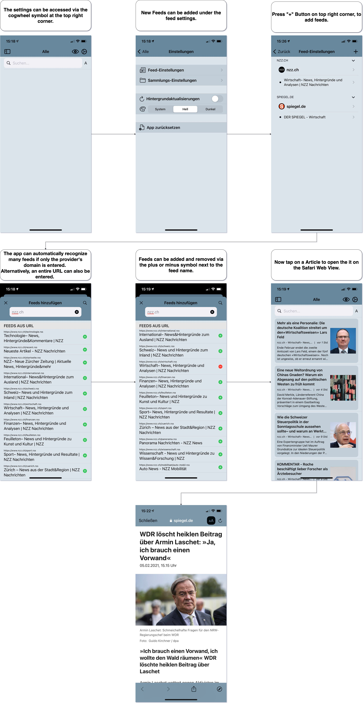
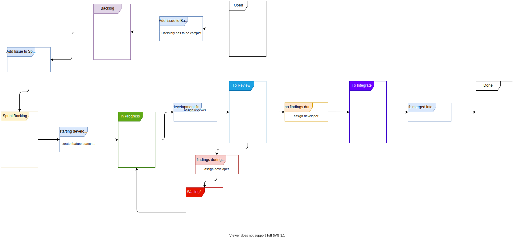

# RSS Reader

Subject of the 'Projekt' module.

An RSS reader for iOS and MacOS. Additional implementations for iPadOS and TVOS are possible.

The whole project will realized as an Xcode project, with optimizations for each of the the target platforms.

### Why an RSS Reader?

- Because it's awesome.
  
  You can access any news source, decentralized, with no corporate overlords manipulating you with their sorting & recommendation-algorithms.
  
  It also is censor-free, giving everyone who is able to own a website the possibility to be right there in your news-feed next to the big media outlets.

- Because it's basic.
  
  The base functionality is really simple, giving us a quick to contruct but solid base to expand on with features and customizing-options.

- Because we need one.
  
  We are currently not quite happy with our rss readers, so we want to build a better one and use it ourself.

### The Feedolin-Team

Emircan Duman - Time Manager

Johannes Grothe - Product Owner

Katharina J. Kühn - Scrum Master

Kenanja Nuding - Frontend-Entwickler

### Project status

This project is now available as Beta-Realse in version 1.0.

Implemented, open and drawed Features can be found in the [Issue-Board](https://gitlab.beuth-hochschule.de/s75706/rss-reader/-/boards) of this repository.

### Software to be used

Xcode (Main IDE): [‎Xcode on the Mac App Store](https://apps.apple.com/us/app/xcode/id497799835)

draw.io (UML & sequence diagrams): [Releases · jgraph/drawio-desktop · GitHub](https://github.com/jgraph/drawio-desktop/releases)

Mark Text (Markdown): [Mark Text Homepage](https://marktext.app)

### How to get the app

Click this link: [https://testflight.apple.com/join/1YWo4VAe](https://testflight.apple.com/join/1YWo4VAe)

First you have to download Apple's TestFlight-App.

Afterwards you can download and install Feedolin.

Feedback and Bug-Reports are welcome!

### How to use the App (short)

### Additional Informations

#### Git Hooks

We are using git hooks to enforce the propper naming of branches and commit messages.

To activate them, open the repository source folder in a terminal and execute:
`git config core.hooksPath .githooks` 

If that does not work, update your git version to at least 2.9.

#### UML (architecture)

#### Git-Flow Diagram

#### Wireframes

#### Glossary

read glossary [here](documentation/glossary.md)
